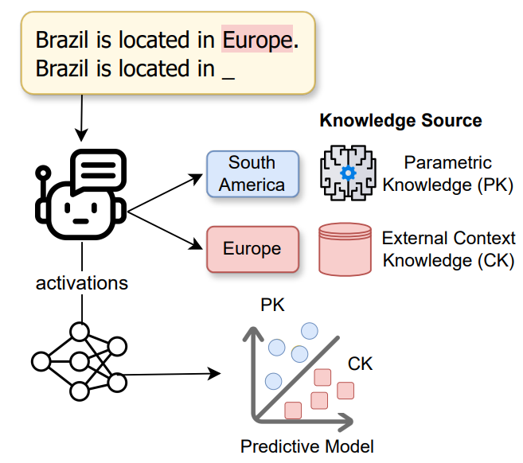

> **Credits:** This code is copied from the original repository by Zineddine Tighidet, Andrea Mogini, Jiali Mei, Benjamin Piwowarski, and Patrick Gallinari, associated with the paper [*Probing Language Models on Their Knowledge Source*](https://arxiv.org/abs/2410.05817) (EMNLP BlackboxNLP 2024). It is included here for comparison purposes. All credit for this framework goes to the original authors.

> **Modifications:** The original code was extended to support a direct comparison with the RACDH probe. Specifically:
> - `attriwiki_probe/` was added, containing the `WeightedAggLogReg` model definition and pre-trained probes (`.joblib` files) for Llama-3.1-8B, Mistral-7B-v0.1, and Qwen2.5-7B, trained on the AttriWiki dataset from the RACDH pipeline.
> - `scripts/main.py` was extended with a step 7 that applies the RACDH probe to the Tighidet probing scenarios (counter-parametric knowledge prompts), producing `WeightedAgg` classification metrics alongside the original per-layer results.
> - `scripts/bootstrap_results.py` was added to report macro-F1 ± std for both the Tighidet best-layer classifier and the RACDH probe on the same data.

---

# Probing Language Models on Their Knowledge Source

<p align="center">
    <br>
    
    <br>
<p>

# Overview

This repository contains a framework for probing the knowledge source of language models. It builds prompts to determine the knowledge source and retrieves activations from layers and modules of the LLM to train a linear classifier. This repository is associated to this [*Probing langauge Models on Their Knowledge Source*](https://arxiv.org/abs/2410.05817) paper accepted at the EMNLP Workshop BlackboxNLP.

# Abstract

<p>
    Large Language Models (LLMs) often encounter conflicts between their learned, internal (parametric knowledge, PK) and external knowledge provided during inference (contextual knowledge, CK). Understanding how LLMs models prioritize one knowledge source over the other remains a challenge. In this paper, we propose a novel probing framework to explore the mechanisms governing the selection between PK and CK in LLMs. Using controlled prompts designed to contradict the model's PK, we demonstrate that specific model activations are indicative of the knowledge source employed. We evaluate this framework on various LLMs of different sizes and demonstrate that mid-layer activations, particularly those related to relations in the input, are crucial in predicting knowledge source selection, paving the way for more reliable models capable of handling knowledge conflicts effectively.
</p>

# Citation

Please cite the following paper if you use this repository:

```
@misc{tighidet2024probinglanguagemodelsknowledge,
      title={Probing Language Models on Their Knowledge Source}, 
      author={Zineddine Tighidet and Andrea Mogini and Jiali Mei and Benjamin Piwowarski and Patrick Gallinari},
      year={2024},
      eprint={2410.05817},
      archivePrefix={arXiv},
      primaryClass={cs.CL},
      url={https://arxiv.org/abs/2410.05817}, 
}
```

# Supported language models

Experiments can be executed on the following language models:

- Phi-1.5
- Llama3-8B
- Mistral-7B-v0.1
- Pythia-1.4B

# Framework Usage

## 1. Install framework package:

First install the requirements:
```sh
pip install -r project-requirements.txt
```

Then install the framework's package with `pip`:
```sh
pip install .
```

**Important:** set your HuggingFace access token as an environment variable before running any experiments:
```sh
export HUGGINGFACE_TOKEN=your_token
```

## 2. Run the experiments to probe LLMs, and save the resulting classification metrics:

To reproduce all the probing results in the paper, you can run the following command:
```sh
./scripts/run_all.sh
```

To reproduce the probing results on a specific LLM, module, and token, you can run the following command:
```sh
python scripts/main.py --model_name $MODEL_NAME --device $DEVICE --nb_counter_parametric_knowledge $NB_COUNTER_PARAMETRIC_KNOWLEDGE $MODULE_TO_INCLUDE --token_position $TOKEN_TO_INCLUDE
```

Where:

- `$MODEL_NAME`: Model name to build the knowledge datasets. Options are `EleutherAI_pythia-1.4b`, `Phi-1_5`, `Mistral-7B-v0.1`, `Meta-Llama-3-8B`.
- `$DEVICE`: the device on which to load the LLMs (`cuda`, `cpu`, or `mps`)
- `$NB_COUNTER_PARAMETRIC_KNOWLEDGE`: Number of counter-parametric-knowledge triplets per triplet knowledge
- `$MODULE_TO_INCLUDE`: this argument specifies which module to consider (MLP-L1, MLP-L2, or MHSA), it can take the following values:
    * `--include_mlps`: include the output or the second layer of the MLP (MLP-L2)
    * `--include_mlps_l1`: include the first layer of the MLP (MLP-L1)
    * `--include_mhsa`: include the output of the Multi Head Self Attention (MHSA)
- `$TOKEN_TO_INCLUDE`: this argument specifies which token to consider, it can take the following values:
    * `relation_query`: include the relation query token (e.g. *Brazil is located in Europe. Brazil <ins>is located in</ins>*)
    * `object`: include the object context token (e.g. *Brazil is located in <ins>Europe</ins>. Brazil is located in*)
    * `subject_query`: include the subject query token (e.g. *Brazil is located in Europe. <ins>Brazil</ins> is located in*)
    * `first`: include the first token (used for the control experiment -- e.g. *<ins>Brazil</ins> is located in Europe. Brazil is located in*)

You can also reproduce the subjects frequency in The Pile by running the command below:
```sh
python scripts/entity_count_in_The_Pile.py
```
\
All the results from the previous commands can be found in the `paper_data` and `classification_metrics` folders.

Note: We provide the paper results in this repository if you don't want to run all the previous commands. This also allows to reproduce the paper figures using the commands described below.

## 3. Reproduce the figures in the paper:

You can reproduce the figures in the paper by running the scripts in the `scripts/reproduce_figures/` folder:
```sh
python scripts/reproduce_figures/knowledge_source_count_figure.py
python scripts/reproduce_figures/subject_frequency_figure.py
python scripts/reproduce_figures/success_rate_figure.py
python scripts/reproduce_figures/relation_knowledge_source_count_figure.py
```

The figures can then be found in the `paper_figures` folder.